# Reverse engineering WWTBAM (2002)

The original QBasic source of this game was lost. This document records
everything that could be recovered from the shipped binaries in 2026, and how.
A best-effort reconstruction of the main program lives in
[`src/WWTBAM.BAS`](../src/WWTBAM.BAS).

## TL;DR

`WWTBAM.EXE` is a **QuickBASIC 4.5 program compiled to a standalone DOS EXE**
(`BC.EXE` + `BCOM45.LIB` — confirmed by the embedded QB runtime error table
and `..\rt\*.asm` module names in the link data). A compiled QB EXE does not
contain the source, but it *does* contain, intact and in source order:

- every string literal of the program,
- every `DATA` statement,
- numeric literals (in a literal pool, as IEEE doubles/singles),
- the original module names (`A1.obj`, `A31.obj`, …) in the linker debug info.

That, plus running the game in DOSBox, was enough to map out the whole
program.

## The `.BBK` masquerade

Every data file ships with the extension `.BBK` (presumably "Bharat Bikram
Kunwar"), but none of them is actually a single format. The main EXE contains
the giveaway — pairs of `SHELL` rename commands that unmask the files before
use and re-mask them afterwards:

```
REN f1.BBK f1.fnt    ...    REN f1.fnt f1.BBK
REN p1.BBK p1.bmp    ...    REN p1.bmp p1.BBK
REN a1.BBK a1.exe    ...    REN a1.exe a1.BBK
REN qm.BBK qm.exe    ...    REN qm.exe qm.BBK
```

| File | Real format | Purpose |
|---|---|---|
| `WWTBAM.DAT` | ZIP archive | the "installer payload" — all game files |
| `SETUP.DAT` | self-extracting EXE | unzips WWTBAM.DAT during install |
| `SETUP.EXE` | QB 4.5 EXE | installer with its own mini DOS shell (`DIR`, `CD`, `MD`, `DRIVE`, `OK`, `EXIT`) |
| `WWTBAM.EXE` | QB 4.5 EXE | the game |
| `QL1/QL2/QL3.BBK` | plain text | question banks: easy / medium / hard |
| `F1–F5.BBK` | bitmap fonts | 4-byte header (width, height as two 16-bit ints: 8×16 or 8×14), then 256 CP437 glyphs |
| `P1.BBK` | 24-bit BMP, 239×520 | photo of the author, shown by `a1.exe` |
| `A1.BBK` | QB 4.5 EXE (`a1.exe`) | help: "About the programmer" (VESA graphics, shows p1.bmp, custom fonts) |
| `A2.BBK` | QB 4.5 EXE (`a2.exe`) | help: "About the game" |
| `A31.BBK` | QB 4.5 EXE (`a31.exe`) | help: support info, registered version |
| `A32.BBK` | QB 4.5 EXE (`a32.exe`) | help: support info, unregistered version |
| `A4.BBK` | QB 4.5 EXE (`a4.exe`) | help: "System requirements" |
| `A5.BBK` | QB 4.5 EXE (`a5.exe`) | help: "Controls" |
| `QM.BBK` | QB 4.5 EXE (`qm.exe`) | the Question Maker (add/edit/remove/view questions) |
| `help.BBK` | text, created at runtime | registration state (see below) |
| `hsl.BBK` | text, created at runtime | hi-score list |

## Question bank format

Seven lines per question:

```
question line 1
question line 2          (often blank)
option A
option B
option C
option D
correct answer           (repeated verbatim as text)
```

Shipped counts: QL1 = 12 questions, QL2 = 15, QL3 = 8. Questions 1–5 of a
game come from QL1, 6–10 from QL2, 11–15 from QL3. The startup check
("There is no enough questions to play the game in the file !!!") requires at
least 5 per bank.

## The money ladders

Found as back-to-back IEEE 754 doubles in the literal pool at file offset
`0x1E92A`, immediately after the "You have won" string:

| Q | Eastern (`Rs.`) | Western (`$` / `points`) |
|---|---|---|
| 1 | 1,000 | 100 |
| 2 | 2,000 | 200 |
| 3 | 3,000 | 300 |
| 4 | 5,000 | 500 |
| 5 | 10,000 | 1,000 |
| 6 | 20,000 | 2,000 |
| 7 | 40,000 | 4,000 |
| 8 | 80,000 | 8,000 |
| 9 | 160,000 | 16,000 |
| 10 | 320,000 | 32,000 |
| 11 | 625,000 | 62,500 |
| 12 | 1,250,000 | 125,000 |
| 13 | 2,500,000 | 250,000 |
| 14 | 5,000,000 | 500,000 |
| 15 | **10,000,000** | **1,000,000** |

The Eastern ladder is exactly the original *Kaun Banega Crorepati* ladder
(top prize Rs 1 crore). The Option menu's Country choice (Eastern/Western)
selects the ladder and the currency symbol; choosing Player's Age = "14 and
below" scores in `points` instead.

(The Western values 1,000 and 2,000 appear only once in the pool because the
QB compiler de-duplicates identical literals across the two ladders.)

## Registration scheme

### The registration key: `WWTBAM_KGOI_BBK_999`

The key is a 16-character prefix plus a 3-digit number. Disassembling the
registration routine shows the check is **not** a plain string compare:

```
0xBB19  mov ax,0x1508        ; offset of the literal "WWTBAM_KGOI_BBK_"
0xBB1D  call <str compare>   ; does code$ start with the prefix?
0xBB22  cmp ax,1 / jz 0xBB86 ; yes -> success branch
...
0xBB86  push code$, 17, 3     ; \
0xBB92  call <MID$>           ;  | n = VAL(MID$(code$, 17, 3))
0xBBA5  call <VAL>            ; /
        ... FP-emulator compare of n against 999 ...
0xBBF8  jmp 0xBB2D            ; n <> 999  -> "incorrect"
0xBBFB  ...                   ; n  = 999  -> "correct"
```

In other words: `INSTR(code$, "WWTBAM_KGOI_BBK_") = 1` **and**
`VAL(MID$(code$, 17, 3)) = 999`. That is why entering the bare prefix is
rejected ("incorrect") — `MID$` of a 16-char string is empty, so `VAL` is 0.
The constant `999` is stored as an IEEE single (`00 00 79 44`) at file offset
`0x1efea`, just past the registry-code literal at `0x1ef8e`.

(My first pass guessed the trailing `$` after the literal was part of the
key — it is not. The literal is exactly 16 bytes; the `$` (`0x24`) is the
low byte of the *next* string descriptor's pointer.)

Verified end to end in DOSBox: Help → `7` (Register) → `WWTBAM_KGOI_BBK_999`
→ "Your registry code is correct." → "registered successfully !!!".

| Help & Support (topic 7 = Register) | Registering with the recovered key |
|---|---|
| 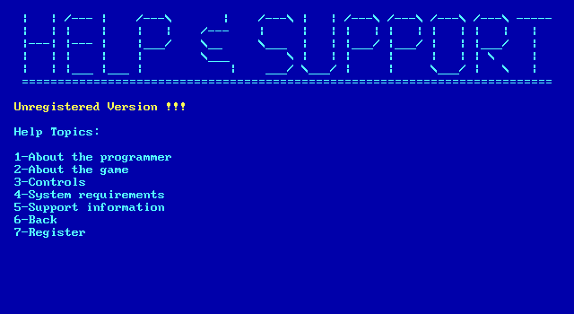 | 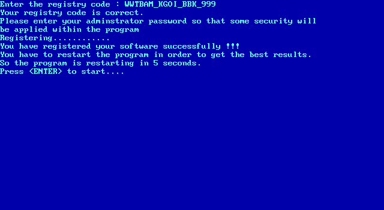 |

### Registration state

Persisted in `help.BBK` (which also holds the help-topic lines) as one of two
binary-looking magic strings found side by side in the EXE. **The mapping is
the opposite of what it looks like** — confirmed by writing each value and
watching the banner:

| Flag in `help.BBK` | Meaning |
|---|---|
| `011001011100` | **registered** |
| `100111110001` | **unregistered** |

- The unregistered version: shows the "Unregistered Version !!!" banner on
  every screen, disables the Question Maker and the random-question feature
  ("Kunwar's Automated Loader" picks questions in file order instead), and
  shows help topic 5 via `a32.exe` instead of `a31.exe`.
- After a successful registration the program asks for an "adminstrator
  password" (stored, not validated), counts 1… to 5… and restarts itself
  (`RUN`), which re-reads `help.BBK` and comes up registered.

## Lifelines

All three of the show's lifelines are implemented (keys `1`, `2`, `3`):

1. **Phone a friend** — five different friends with five fully scripted
   dialogues (all recovered verbatim, see `src/WWTBAM.BAS`), a `30/30`
   countdown clock, and the immortal player response prompt:
   `(1) OK! / (2) Be serious coz I dont think so!`
   Friend #5 hedges with "only 49 %" / "51 %".
2. **50:50** — "Let the two incorrect answers be gone....". The EXE carries a
   DATA table of the twelve possible surviving pairs:
   `AB BA BC CB CD DC AD DA AC CA BD DB`.
3. **Audience vote** — "Audiences will be given 10 seconds to give vote !!!",
   a 10-second countdown, then a bar chart of A–D percentages.

## Program flow (verified by running the EXE in DOSBox)

1. Startup: check question banks, read registration state from `help.BBK`.
2. Title intro (~25 s, reconstructed from a frame-by-frame DOSBox capture
   plus a PC-speaker audio capture decoded back into notes):
   - The spotlight rings are built from *hundreds of concentric `CIRCLE`
     ellipses* (the moiré banding is visible on screen), stage by stage:
     thin blue rims, the wide dark-blue band, a thick light-blue rim, then
     the thick magenta ring.
   - A fan of white spokes sweeps 360° around the hub.
   - The title fills in **from the centre outwards**: the E of "BE"
     (position 15 of 29) is seeded first, then letters appear alternately
     right/left — positions 16,14,17,13,… 29,1. That order is exactly the
     scrambled `DATA` block in the EXE
     (`" ","B","A"," "," ","O","M","T","I",…`).
   - The music is the show's "lights down" theme on PC speaker. Decoded
     from the captured audio: D / six short C's (one per ring stage,
     `L7 C` ≈ 0.29 s each) / dotted C's (`l2 C...`) / D–E♭ runs under the
     letters / the climb C. D. E♭ F `L2 G..` and an octave-up `>C` to
     finish. All fragments match the recovered `PLAY` literals verbatim.
   - Finale: `CLS`, then `PALETTE` attribute-0 floods — deep blue, then a
     lavender shade (not in the standard 16-colour set) — for the credits
     card "BY BHARAT BIKRAM KUNWAR" + email + website, then straight into
     the menu with no keypress.
3. Main menu (the show's hexagonal "lozenge" straps): Play / Option / Quit,
   `H` for help.
4. Option menu: Country (Eastern/Western), Player's Age (Above 14 / 14 and
   below), Questions (shells out to `qm.exe`), DONE.
5. Loading screen: "Kunwar's Automated Loader, Copyright(c) 2002".
6. Game: 15 questions, answer with `A`–`D`, `ESC` to quit (with confirm),
   milestones at Q5/Q10. Correct: lozenge turns green, "Yeah ! You are
   right !", "You have won Rs. N !". Wrong: "Oh no ! You made it wrong !
   Better luck next time !".
7. Hi-score list (`hsl.BBK`): name (max 8 letters), score, date, time, and
   which lifelines were used.
8. Win: "You are a winner !!!" celebration screen.
9. Help menu: big ASCII-art "HELP & SUPPORT" banner (stored line by line in
   the EXE), topics 1–7; topics shell out to the masked `a*.exe` helpers.

## Screenshots (original EXE running in DOSBox)

The PC-speaker intro theme, captured from the original EXE, is in
[`intro-theme.wav`](intro-theme.wav).

| | |
|---|---|
| 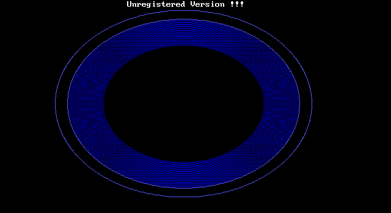 | 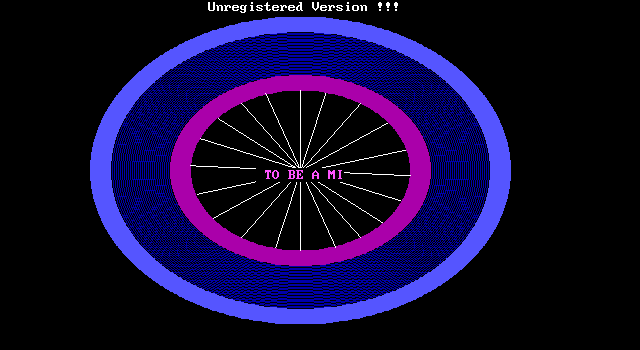 |
| 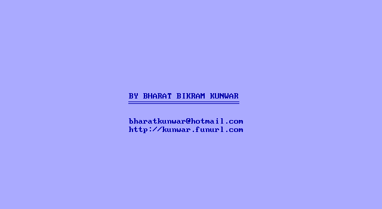 | 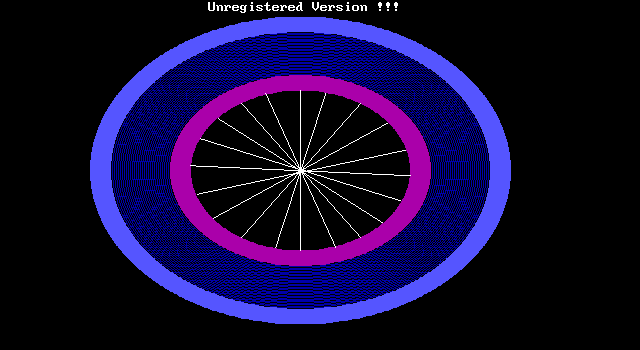 |
| 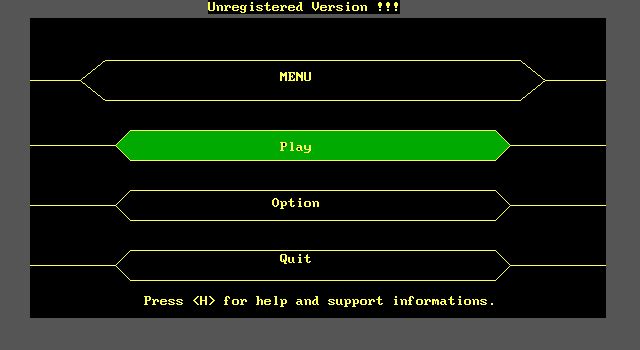 | 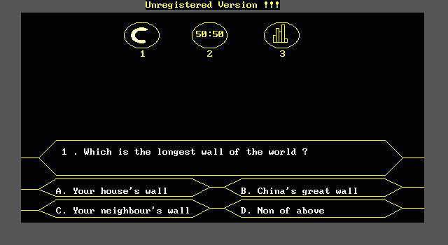 |
| 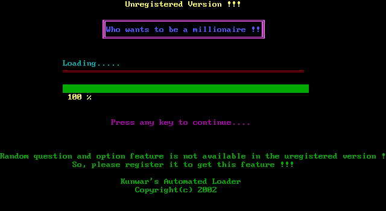 | 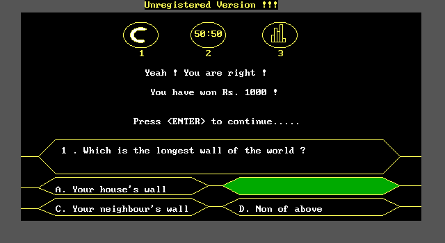 |
| 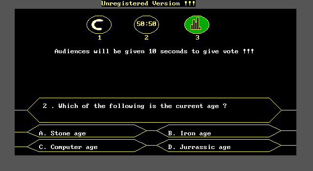 | |

## What is exact vs. reconstructed in `src/WWTBAM.BAS`

**Exact (recovered from the binary):** all strings/messages/dialogue, money
ladders, 50:50 pair table, title letter DATA, music fragments, file names,
the REN masking scheme, the registry code, registration magic strings,
question file format, menu structure and key bindings.

**Reconstructed (not recoverable from compiled code, matched against the
running game):** variable names, exact screen coordinates, procedure
boundaries, loop internals, the audience-vote distribution function, timing
constants. The original was almost certainly written as line-numbered/GOSUB
spaghetti rather than the SUB structure used here.

The helper programs (`a1`–`a5`, `qm`, `setup`) are separate QB modules; their
full string tables are recoverable the same way (`strings -n 3 <file>` and
look after the `run-time error` marker) but only the main game has been
reconstructed as source.

## Reproducing the analysis

```sh
unzip WWTBAM.DAT -d extracted     # the .DAT is just a ZIP
file extracted/*                  # real formats reveal themselves
strings -n 3 extracted/WWTBAM.EXE # program literals after the runtime table
# money ladder: scan for IEEE doubles around offset 0x1E92A
# run it: dosbox extracted/WWTBAM.EXE  (mount the extracted dir as C:)
```
